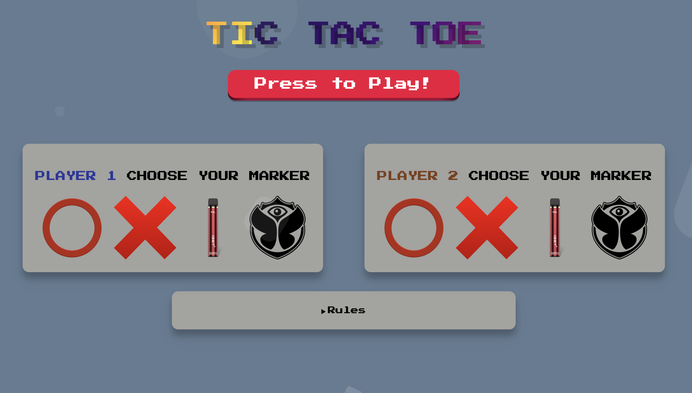
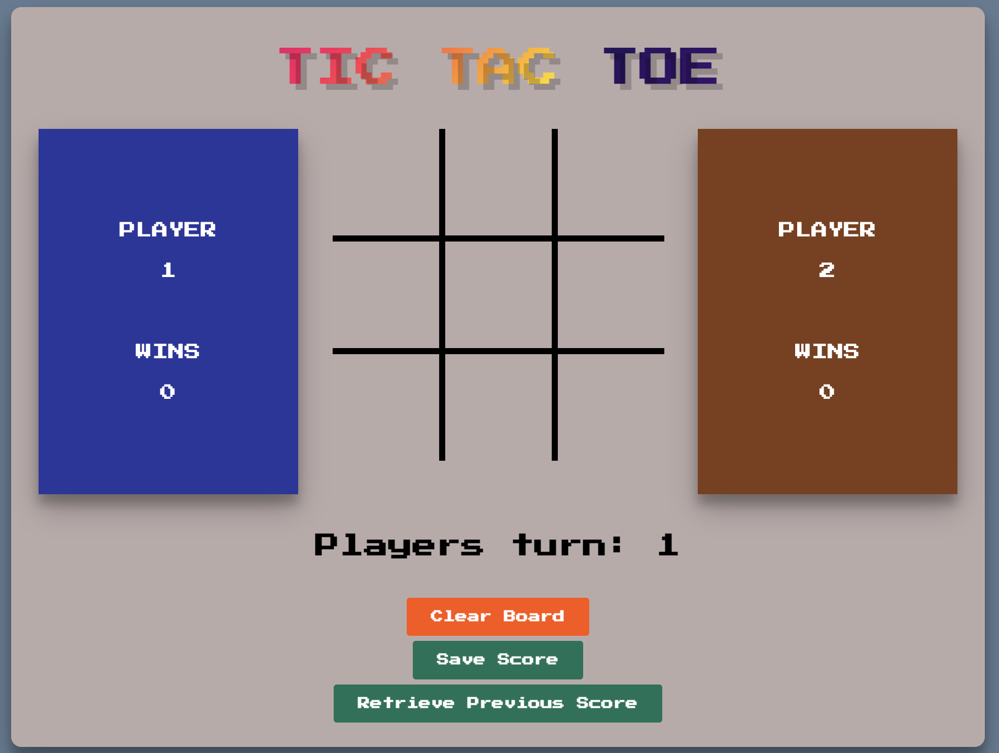
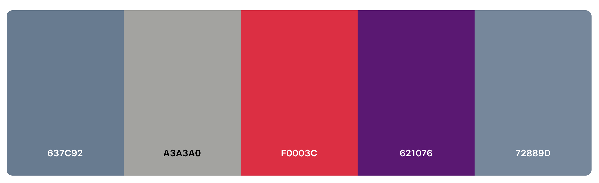

<h1 style="text-align: center; line-height:  80px;">TIC TAC TOE - Project 0 </h1>

<h2 style="text-align: center;">Welcome to project Elias Khoury's project</h2>

<h3 style="text-align: center; line-height: 50px;">This a responsive tic-tac-toe game with the options to select different markers, written in HTML, CSS and javascript.</h3>

Accessible online at [https://eliasskhouryy.github.io/project-0/](https://eliasskhouryy.github.io/project-0/)

------
-----
 

## **Table of Contents**

- [Design](#design)
- [Built With](#built-with)
- [Functionality](#functionality)
- [Creator](#creator)
- [Acknowledgments](#acknowledgments)  
  
------
------
   

## Design
 

### Fonts

[Press Start 22p](https://fonts.googleapis.com/css2?family=Press+Start+2P&display=swap) - this is a classic bitmap font that is based on the Namco arcade games design.     

 

### Main Color Scheme

 

### Other design factors
- It has been optimised used media query for mobile use as well.
- There are few animated aspects (the title and the initial backdrop).

-------
------

 

## Built With

- [HTML5](https://www.w3schools.com/html/)
- [CSS3](https://www.w3schools.com/css/)
- [JavaScript](https://www.w3schools.com/js/DEFAULT.asp) with the [JQuery](https://jquery.com/) library.
- Hosted on [Github](https://github.com/)

 

---
______

## Functionality
- You can select different player markers.
- Sound effects on placing a marker and a win sound.
- Local storage is enabled with a **save** and **retrieve previous score** button.
- Clear board button has been implemented incase of any current ingame issues.

 

---
______

 

## Creator

- **Elias Khoury** - a student of General Assembly.

 

-----
----

 

## Acknowledgments 
- General Assembly teachers (*Joel & Loden*) and other student feedback. 
- Coffee
- Youtube
- Dual monitors